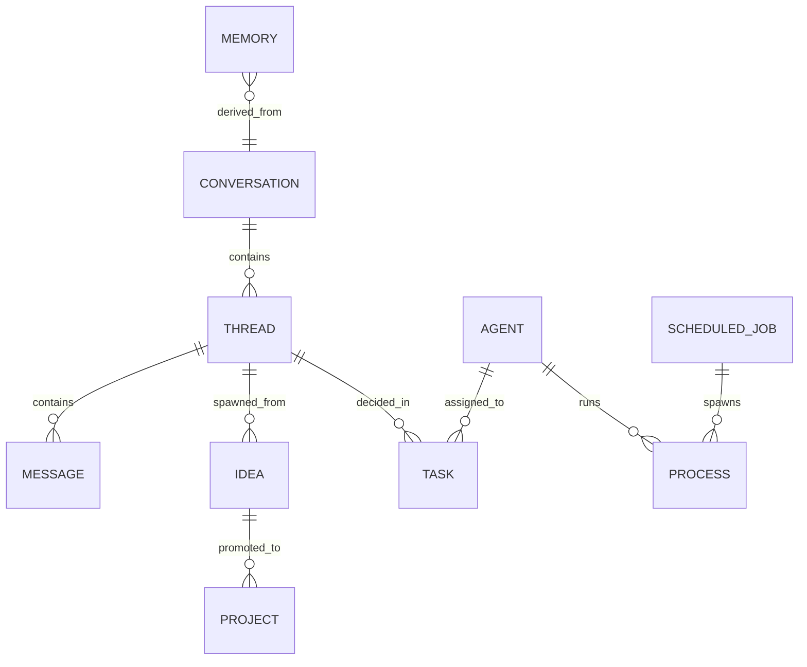

# Agent-OS Schema V2 Plan

**Goal:** Upgrade Agent-OS from a passive CRM into a proactive Agency Operating System that manages Ideas, Tasks, Reminders, and Autonomous Workers (Sub-agents), all linked via semantic search and conversation context.

---

## 1. Core Philosophy

1.  **Everything is Vectorized:** Every entity (`ideas`, `reminders`, `agents`, `jobs`) has a `vector(768)` column for semantic recall.
2.  **Conversation is Context:** Tasks and Plans (`blueprints`) link back to the `conversation` or `thread` where they were decided.
3.  **Active Execution:** `scheduled_jobs` (Cron) and `processes` (Live PIDs) track the *doing*, not just the *planning*.

---

## 2. New Schema Modules

### 🧠 Thought Stream (Input)

#### `ideas`
Low-friction entry. Captures fleeting thoughts before they become tasks or projects.
*   **Columns:** `content` (text), `tags` (text[]), `source` (text - e.g. "chat", "voice"), `embedding` (vector).
*   **Relationships:** Can be promoted to `Task` or `Project`.

#### `reminders`
Time-sensitive nudges.
*   **Columns:** `title`, `due_at` (timestamptz), `completed_at`, `recurrence` (text - e.g. "daily"), `embedding` (vector).
*   **Relationships:** `related_entity_id` (polymorphic link to Task/Person/Deal).

#### `memories` (Enhancement)
*   **Existing:** Already in V1 schema.
*   **Update:** Ensure `embedding` vector dimension matches (768). Add `importance` (1-10) and `verified` (boolean) flags for improved recall ranking.

---

### 💬 Context Layer (Conversation)

#### `threads` (New)
*   **Columns:** `title`, `summary`, `status` (active/archived), `embedding` (vector).
*   **Relationships:** `parent_thread_id` (for nested discussions).

#### `chat_messages` (Enhancement)
*   **Update:** Link to `thread_id`. Add `role` (user/agent/system/tool).
*   **Vector:** Embed message content for "What did we say about X?" searches.

---

### ⚙️ Execution Layer (The Doing)

#### `agents` (Workers)
Register available sub-agents/workers.
*   **Columns:** `name` ("Researcher"), `role` ("crawler"), `capabilities` (jsonb - tools), `config` (jsonb - model/temperature), `status` (idle/busy/offline), `embedding` (vector).

#### `processes` (Live Work)
Track long-running background jobs.
*   **Columns:** `agent_id` (FK), `pid` (int - system PID), `command` (text), `started_at`, `status` (running/completed/failed), `logs_path`, `exit_code`, `embedding` (vector - "Find the process that scraped X").

#### `scheduled_jobs` (Cron)
Source of truth for recurring tasks.
*   **Columns:** `name`, `schedule` (cron syntax - "0 9 * * 1"), `command` (text), `active` (boolean), `last_run`, `next_run`, `embedding` (vector).
*   **Strategy:** System generates `crontab` or `launchd.plist` dynamically from this table.

---

### 🗺️ Planning Layer (The Plan)

#### `blueprints` (Enhancement)
A Blueprint is the "Architecture" of a task (the reusable plan).
*   **Update:** Link to `conversation_id` ("Plan created in Chat #123").
*   **Vector:** Semantic search for "Do we have a plan for onboarding?"

#### `tasks` (Enhancement)
*   **Update:** Add `assigned_agent_id` (FK to agents).
*   **Link:** `conversation_id` (Context).
*   **Vector:** Semantic search for "Find tasks related to database migration".

---

## 3. Relationships Diagram

---

## 4. Migration Plan

1.  **Update `agent-os` Package:** Add new table definitions to `packages/provision/src/schemas/`.
2.  **Provision:** Run `provision` script to apply changes (Constructive is idempotent, will add missing tables).
3.  **Codegen:** Regenerate SDK to get new types (`pnpm run generate`).
4.  **Verify:** Test inserting an Idea and searching for it via vector.
